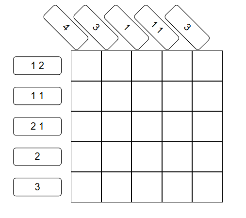
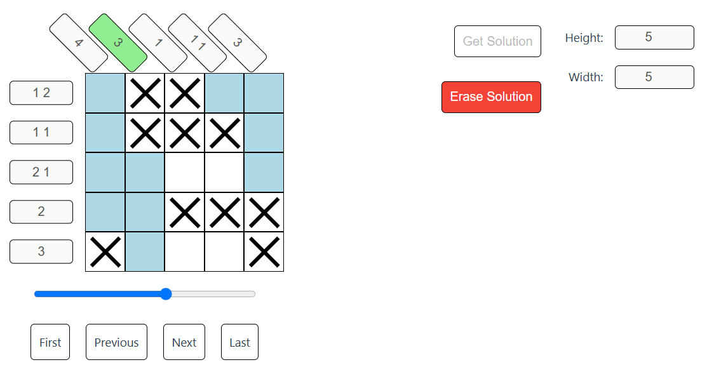

# nonogram

Solves the game of Nonogram

## Game

The goal of this game is to select a set of cells on a board with some constraints on the rows and columns.



In the above example,

- In the first row, there must be one selected cell separated from a selected block of two consecutive cells. There must be no other selected cell.
- In the second row, there must be one selected cell separated from another selected cell. There must be no other selected cell.

So on and so forth, for all the rows and columns. The goal of the game is then to select cells such that all constraints on the rows and columns are satisfied.

The game was solved as a constraint satisfaction problem (CSP). At each iteration, a row/column with the lowest number of possible combinations is resolved.

I made a web page to demonstrate the algorithm.



## Setup

### Frontend

Install the dependencies, and build the static files.

```bash
cd frontend
npm install
npm run build
```

To serve the frontend files from backend, you must copy the compiled static files into `src/main/resources/resources`. In root directory of this repository:

```bash
mkdir src/main/resources
cp frontend/dist src/main/resources/resources
```

### Backend

Install the dependencies, and build the jar file.

```bash
mvn install
mvn package
```

You are good to go to build the docker image.

### Docker

Run the following command to build the docker image, and run it on port `80`:

```bash
docker build --tag nonogram .
docker run -p 80:8080 -d nonogram
```
